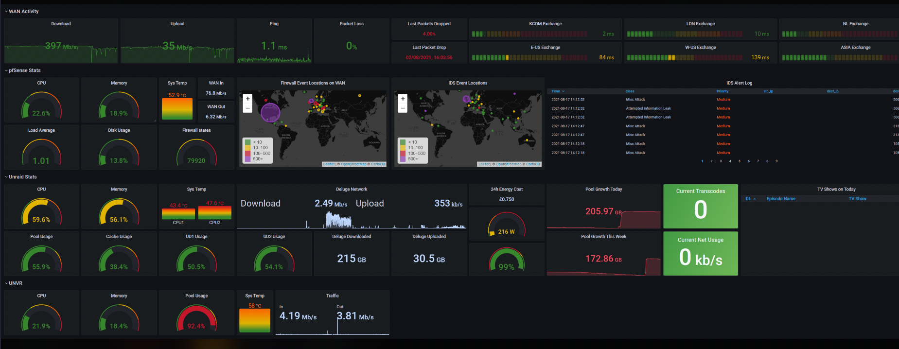

# Synthetic Monitoring Platform

## Overview
The **Synthetic Monitoring Platform** is a sophisticated, real-time network monitoring solution designed to provide continuous tracking of key network performance metrics, including packet loss, round-trip time (RTT), and ping success rate. Built with scalability in mind, the system operates continuously to analyze network reliability, optimize performance visualization, and track overall system health, ensuring proactive issue detection and resolution.

This dashboard was created with Grafana 9.5.2.


## Features & Capabilities
- **Automated Network Data Collection:** Leverages `pingparsing` to parse and analyze ping responses, extracting critical network performance metrics.
- **Flexible and Scalable Configuration:** Implements a YAML-based configuration system (`PyYAML`), allowing users to specify multiple monitoring targets with ease.
- **Efficient Metrics Export & Storage:** Integrates with `prometheus_client` to expose network performance data in a structured format suitable for analysis.
- **Real-Time Visualization & Analytics:** Seamlessly integrates with **Grafana**, providing an intuitive dashboard for visualizing network health and performance trends.
- **Proactive Network Health Monitoring:** Ensures continuous uptime monitoring, reducing downtime by detecting and alerting administrators to network issues before they escalate.

## System Architecture
The Synthetic Monitoring Platform consists of three main components:

### 1. **Ping Synthetic Monitoring**
- Performs **ICMP ping requests** to verify the availability and response time of specified network devices.
- Captures key network performance indicators:
  - **Packet Loss:** Percentage of packets lost in transmission.
  - **Round Trip Time (RTT):** Time taken for a packet to travel to a destination and back.
  - **Ping Success Rate:** Percentage of successful ping attempts over a given time frame.
- Acts as the first diagnostic step in network troubleshooting and service uptime verification.

### 2. **Prometheus for Data Collection & Storage**
- Serves as the central time-series database for storing network performance metrics.
- Uses various metric types:
  - **Counters:** Accumulate values over time (e.g., number of pings sent and received).
  - **Gauges:** Represent real-time fluctuating values (e.g., current RTT, active connections).
  - **Histograms:** Measure performance distributions over time (e.g., response time latency percentiles).
- Enables efficient metric querying and alerting for network reliability analysis.

### 3. **Grafana for Visualization & Alerting**
- Provides an interactive **dashboard** to visualize historical and real-time network performance trends.
- Offers comprehensive visualization options, including graphs, heatmaps, and time-series analysis.
- Supports customizable alerts and notifications based on predefined network performance thresholds.

## Installation & Deployment
### Prerequisites
Before deploying the Synthetic Monitoring Platform, ensure that the following dependencies are installed:
- **Python (3.x)**
- **Prometheus** (for time-series metric storage and querying)
- **Grafana** (for data visualization and monitoring dashboards)
- **Required Python libraries:**
  ```sh
  pip install pingparsing PyYAML prometheus_client
  ```

### Setup & Configuration
1. **Clone the repository:**
   ```sh
   git clone https://github.com/your-repo/synthetic-monitoring-platform.git
   cd synthetic-monitoring-platform
   ```
2. **Modify monitoring configuration:**
   - Edit the `names.yaml` file to define IP addresses or domain names to be monitored.
   - Example YAML configuration:
     ```yaml
     targets:
       - ip: "8.8.8.8"
         description: "Google DNS Server"
       - ip: "1.1.1.1"
         description: "Cloudflare DNS Server"
     ```
3. **Start the monitoring service:**
   ```sh
   python client_py_democode.py
   ```
4. **Configure Prometheus:**
   - Edit `prometheus.yml` to define the metrics endpoint for scraping.
   - Example Prometheus configuration:
     ```yaml
     scrape_configs:
       - job_name: 'ping_monitor'
         static_configs:
           - targets: ['localhost:9090']
     ```
   - Start Prometheus:
     ```sh
     prometheus --config.file=prometheus.yml
     ```
5. **Set up Grafana for visualization:**
   - Add Prometheus as a data source.
   - Import a pre-configured Grafana dashboard for network monitoring.
   - Define alerting rules to receive notifications based on metric thresholds.

## Benefits of Synthetic Monitoring
- **Proactive Issue Detection:** Identifies and mitigates network failures before they impact end-users.
- **Performance Optimization:** Continuously tracks latency and response times to optimize network operations.
- **High Availability Assurance:** Ensures uptime by monitoring services across multiple global locations.
- **Comprehensive Observability:** Integrates synthetic monitoring with real-time system logs for a holistic view of network health.
- **Scalability & Customization:** Allows easy expansion of monitored targets and flexible metric definitions.

## License
This project is licensed under the MIT License. See the `LICENSE` file for details.

## Maintainer & Contact
- **Contact:** clairechenszeying@gmail.com

